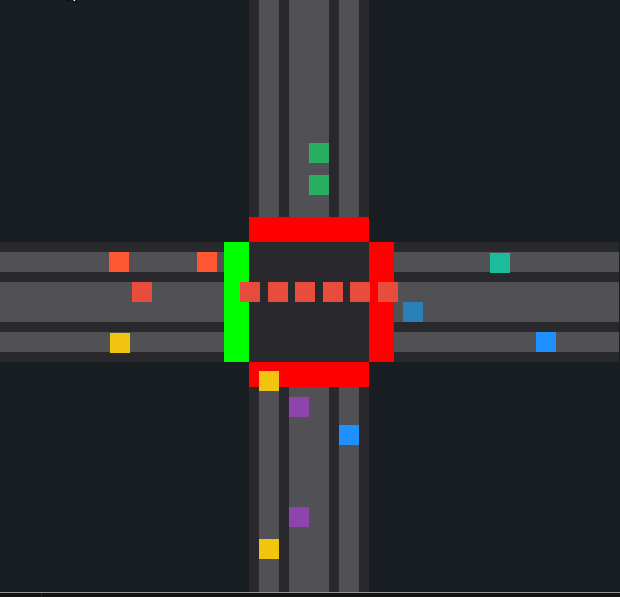

# Traffic Intersection Simulation
#  Name : Nischal Bhatta
#  Roll no.:13
#  Section:CS-A
## Overview

This project is a traffic intersection simulation that models vehicle movement, traffic lights, and adaptive traffic management. The simulation uses SFML (Simple and Fast Multimedia Library) to create a visual representation of a four-way intersection with multiple lanes, traffic signals, and vehicle behavior.

## Features

- Real-time traffic simulation with multiple lanes
- Adaptive traffic light management based on traffic density
- Priority-based scheduling for emergency lanes
- Vehicle collision avoidance system
- Different vehicle behaviors including straight movement and turning
- Visual representation of roads, lanes, vehicles, and traffic lights

## Requirements

- C++ compiler with C++11 support
- SFML library (2.5.0 or higher)
- Standard C++ libraries: algorithm, cmath, cstdlib, ctime, iostream, mutex, vector

## Installation

### Install SFML

On Debian/Ubuntu systems:

```bash
sudo apt-get install libsfml-dev
```

On Fedora:

```bash
sudo dnf install SFML-devel
```

On macOS with Homebrew:

```bash
brew install sfml
```

### Build the Application

1. Clone this repository:

```bash
git clone https://github.com/NischalBhatta9/dsa-queue-simulator.git
cd dsa-queue-simulator
```

2. Compile the source code:

```bash
make
```

## Running the Simulation

Execute the compiled program:

```bash
./traffic_sim
```

- Press `Q` to quit the simulation.

## How It Works

### Simulation Demo



### Intersection Layout

The simulation models a four-way intersection with:

- Four roads (left, right, top, bottom)
- Twelve lanes in total (3 for each direction)
- Four traffic lights (one for each direction)

### Traffic Management

The program implements an adaptive traffic management system:

1. **Priority Lanes**: Designated lanes that get priority when they have more than 5 waiting vehicles
2. **Waiting Vehicle Analysis**: Tracks stopped vehicles in each lane
3. **Dynamic Green Light Duration**: Calculates optimal green light timing based on traffic density
4. **Fairness Algorithm**: Ensures all directions get service even with varying traffic patterns

### Vehicle Behavior

Vehicles in the simulation exhibit the following behaviors:

- Movement along lanes with appropriate speed
- Stopping at red traffic lights
- Maintaining safe distances from other vehicles
- Turning behavior at intersections (straight, right turns)
- Exit detection when vehicles leave the simulation area

## Code Structure

### Main Classes

- `TrafficLight`: Manages traffic light states (red/green)
- `Road`: Represents the road segments
- `Car`: Models vehicle behavior, position, and movement
- `Lane`: Manages a collection of cars and their interaction with traffic lights

### Key Functions

- `findLaneWithMostCars()`: Identifies the lane with highest traffic density
- `calculateGreenDuration()`: Computes optimal green light timing
- `countStopped()`: Counts stopped vehicles in a lane group
- `calculateTotalWaiting()`: Determines total waiting vehicles

## Customization

You can modify various parameters in the code to customize the simulation:

- Vehicle spawn rates
- Vehicle speeds
- Traffic light timing algorithms
- Lane configurations
- Priority thresholds

## Notes

- The simulation uses a mutex to prevent race conditions when updating traffic light states
- Font path may need adjustment based on your system configuration
- The framerate is limited to 300 FPS for consistent simulation timing
